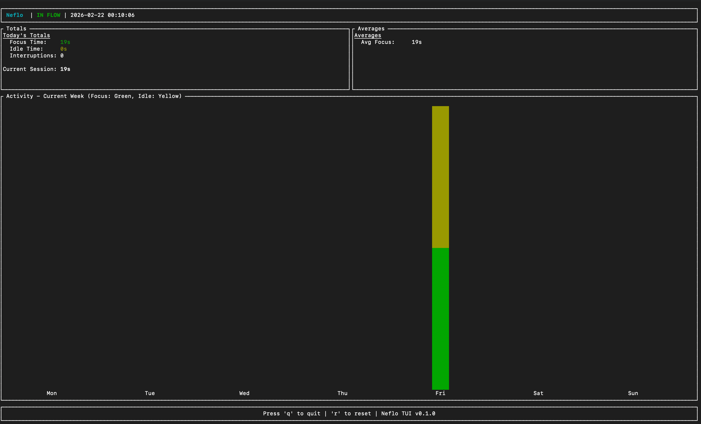

# Usage Guide

Neflo provides two main ways to interact with it: the real-time TUI dashboard and a command-line reporting tool.

## Starting the Tracker

To start tracking your activity, use the `start` command:

```bash
neflo start
```

### Custom Idle Threshold

By default, Neflo considers you "idle" after 5 minutes of inactivity. You can override this using the `--threshold` (or `-t`) flag:

```bash
neflo start --threshold 10
```

The threshold is specified in minutes.

### Operating Window and Timeouts

Neflo allows you to limit the tracking session to a specific time window or duration.

#### Start and End Times

You can specify a start time, an end time, or both using 24h format (HH:MM). If a start time is set, the app will wait (displaying "WAITING") until that time is reached before it starts tracking. If an end time is set, the app will stop tracking (displaying "SESSION ENDED") once that time is reached.

```bash
# Start tracking at 9:00 AM (24h format)
neflo start -s 09:00

# Stop tracking at 6:00 PM (24h format)
neflo start -e 18:00
```

#### Duration

You can specify a duration for the session (e.g., `8h`, `30m`). If a duration is set, it takes precedence over start/end times: tracking starts immediately and stops once the duration has elapsed.

```bash
# Track for 4 hours
neflo start -d 4h

# Track for 30 minutes
neflo start -d 30m
```

## The TUI Dashboard

When you run `neflo start`, a Terminal User Interface (TUI) opens.



### Layout
- **Header**: Shows the current status (IN FLOW or IDLE) and the current time.
- **Totals**: Displays today's total focus time, idle time, and the number of interruptions.
- **Averages**: Shows average focus and idle session lengths for the day.
- **Activity Chart**: A weekly bar chart (Monday to Sunday) showing focus (green) and idle (yellow) time.
- **Footer**: Displays available keyboard shortcuts.

### Shortcuts
- `q`: Quit the tracker and save data.
- `r`: Reset the database (clears all recorded intervals).

## Generating Reports

If you want a quick summary without opening the TUI, use the `report` command:

```bash
neflo report
```

This will print the current week's statistics (starting from Monday) directly to your terminal. Note that while Neflo retains up to 30 days of data, the report focuses exclusively on the current week.

## Updating Neflo

To update Neflo to the latest version directly from GitHub:

```bash
neflo self-update
```

## Data Storage

Neflo stores its data and configuration in your home directory:
- `~/.neflo/db.json`: The database of recorded intervals.
- `~/.neflo/config.json`: Persistent configuration settings.

---

[Home](index.md) | [Previous: Setup](setup.md) | [Next: Architecture](architecture.md)
